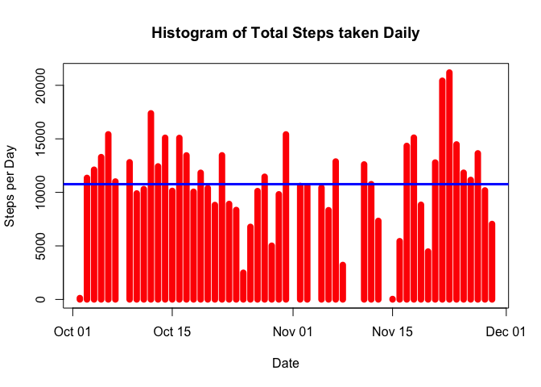
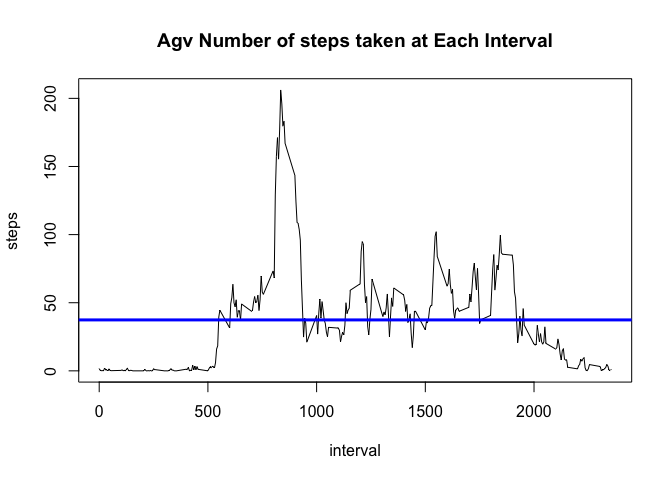
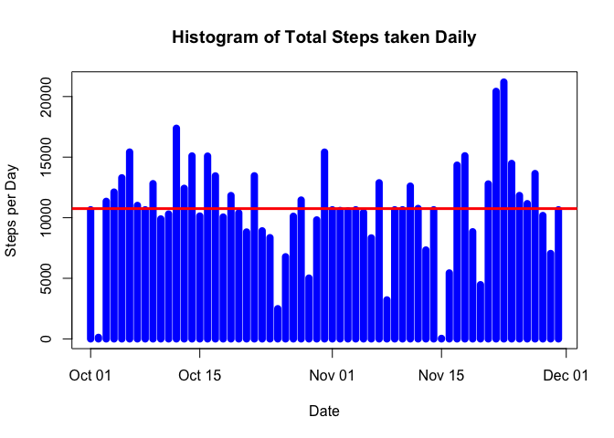
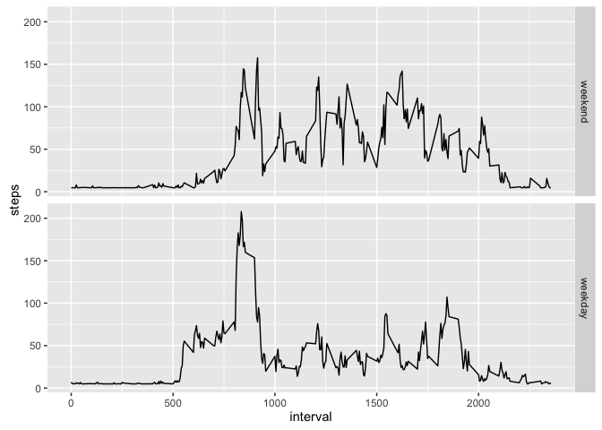

# Reproducible Research: Peer Assessment 1


## Loading and preprocessing the data

```r
activityData <- read.csv("activity.csv",sep = ",",header = TRUE)
activityData$date <- as.Date(activityData$date)
```

## What is mean total number of steps taken per day?

```r
## Agreegate the total steps by day 
aggregateByDate <- aggregate(steps ~ date,activityData,sum)
## plot the histogram 
with(aggregateByDate,plot(date,steps,type = "h",lwd = 8,col = "red",main="Histogram of Total Steps taken Daily", xlab="Date", ylab="Steps per Day"))
with(aggregateByDate,abline(h=mean(steps,na.rm = TRUE),col = "blue",lwd = 3))
```

\
**Calculate and report the mean and median of the total number of steps taken per day**

```r
## Mean Calculation 
paste("Mean Steps per Day =", mean(aggregateByDate$steps, na.rm=TRUE))
```

```
## [1] "Mean Steps per Day = 10766.1886792453"
```

```r
## Median Calculation 
paste("Median Steps per Day =", median(aggregateByDate$steps, na.rm=TRUE))
```

```
## [1] "Median Steps per Day = 10765"
```


## What is the average daily activity pattern?

```r
##time series plot (i.e. 𝚝𝚢𝚙𝚎 = "𝚕") of the 5-minute interval (x-axis) and the average number of steps taken, averaged across all days (y-axis)
aggregateByInterval <- aggregate(steps ~ interval,activityData,mean)
with(aggregateByInterval, plot(interval,steps,type='l',main = "Agv Number of steps taken at Each Interval"))
with(aggregateByInterval,abline(h=mean(steps,na.rm = TRUE),lwd = 3,col = "blue"))
```

\

```r
### Which 5-minute interval, on average across all the days in the dataset, contains the maximum number of steps?
paste("Interval with maximum steps =", aggregateByInterval$interval[which(aggregateByInterval$steps == max(aggregateByInterval$steps))])
```

```
## [1] "Interval with maximum steps = 835"
```

```r
paste("Maximum steps =", max(aggregateByInterval$steps))
```

```
## [1] "Maximum steps = 206.169811320755"
```


## Imputing missing values


```r
###Calculate and report the total number of missing values in the dataset
sum(is.na(activityData$steps))
```

```
## [1] 2304
```

```r
###strategy for filling in all of the missing values in the dataset
## Replacing missing values with mean of the column 
activityData$steps[is.na(activityData$steps)] <- round(mean(activityData$steps, na.rm = TRUE))

## New Dataset with the missing values filled in 
aggregateByDateNoNA <- aggregate(steps ~ date,activityData,sum)

## histogram of the total number of steps taken each day
with(aggregateByDateNoNA,plot(date,steps,type = "h",lwd = 8,col = "blue",main="Histogram of Total Steps taken Daily", xlab="Date", ylab="Steps per Day"))
with(aggregateByDateNoNA,abline(h=mean(steps,na.rm = TRUE),col = "red",lwd = 3))
```

\
**Calculate and report the mean and median of the total number of steps taken per day**

```r
## Mean Calculation 
paste("Mean Steps per Day no Missing Values =", mean(aggregateByDateNoNA$steps, na.rm=TRUE))
```

```
## [1] "Mean Steps per Day no Missing Values = 10751.737704918"
```

```r
## Median Calculation 
paste("Median Steps per Day no Missing Values =", median(aggregateByDateNoNA$steps, na.rm=TRUE))
```

```
## [1] "Median Steps per Day no Missing Values = 10656"
```

## Are there differences in activity patterns between weekdays and weekends?


```r
### Create a new factor variable in the dataset with two levels – “weekday” and “weekend” indicating whether a given date is a weekday or weekend day
activityData$day <- weekdays(as.Date(activityData$date))
activityData$weekday <- factor((activityData$day %in% c("Monday","Tuesday","Wednesday","Thursday","Friday")),levels=c(FALSE, TRUE), labels=c('weekend', 'weekday'))
### panel plot containing a time series plot (i.e. 𝚝𝚢𝚙𝚎 = "𝚕") of the 5-minute interval (x-axis) and the average number of steps taken, averaged across all weekday days or weekend days (y-axis)
aggActivityData <-aggregate(steps ~ interval + weekday , data = activityData,FUN = mean, na.rm=TRUE)

## Plot 
library(ggplot2)
g <- ggplot(aggActivityData,aes(interval,steps)) + geom_line()
g + facet_grid(weekday ~.)
```

\

